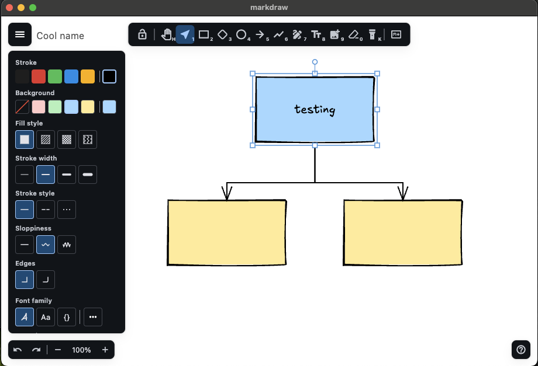

# markdraw

An Excalidraw-inspired drawing widget for Flutter with a human-readable markdown serialization format.

Cross-platform: iOS, Android, Web, macOS, Windows, Linux.



## Features

- Hand-drawn aesthetic powered by `rough_flutter`
- Full element set: rectangles, ellipses, diamonds, lines, arrows, freedraw, text, images, frames
- Arrow binding with elbow routing
- Element grouping, locking, and frames with clip regions
- Selection, multi-select, resize, rotate, and nudge
- Undo/redo with drag coalescing
- Copy/paste via system clipboard
- Export to PNG and SVG (with embedded `.markdraw` for round-trip)
- Excalidraw JSON import/export (`.excalidraw` and `.excalidrawlib`)
- Reusable element libraries (`.markdrawlib`)
- Google Fonts integration with bundled Excalifont
- Responsive layout: desktop toolbar + side panels, compact bottom bar + sheets
- Keyboard shortcuts for every tool
- Pinch-to-zoom and scroll-wheel zoom
- Dark mode theming
- Live markdown split-pane editor with bidirectional sync
- Human-readable `.markdraw` file format (git-friendly, diffable)

## Quick Start

A minimal drawing canvas in six lines:

```dart
import 'package:flutter/material.dart' hide Element, SelectionOverlay;
import 'package:markdraw/markdraw.dart' hide TextAlign;

void main() {
  runApp(MarkdrawApp(
    home: (context, themeMode, onThemeModeChanged) => MarkdrawEditor(
      currentThemeMode: themeMode,
      onThemeModeChanged: onThemeModeChanged,
    ),
  ));
}
```

This gives you a full editor with toolbar, property panel, zoom controls, keyboard shortcuts, and undo/redo &mdash; no file I/O wiring needed.

## Full Example with File I/O

The [example app](example/main.dart) adds file open/save, PNG/SVG export, image import, and library management via `MarkdrawFileHandler`:

```dart
import 'package:flutter/material.dart' hide Element, SelectionOverlay;
import 'package:markdraw/markdraw.dart' hide TextAlign;

void main() {
  runApp(MarkdrawApp(
    home: (context, themeMode, onThemeModeChanged) => _CanvasPage(
      themeMode: themeMode,
      onThemeModeChanged: onThemeModeChanged,
    ),
  ));
}

class _CanvasPage extends StatefulWidget {
  const _CanvasPage({
    required this.themeMode,
    required this.onThemeModeChanged,
  });

  final ThemeMode themeMode;
  final void Function(ThemeMode) onThemeModeChanged;

  @override
  State<_CanvasPage> createState() => _CanvasPageState();
}

class _CanvasPageState extends State<_CanvasPage> {
  final _controller = MarkdrawController();
  late final _files = MarkdrawFileHandler(controller: _controller);

  @override
  void dispose() {
    _controller.dispose();
    super.dispose();
  }

  @override
  Widget build(BuildContext context) {
    return MarkdrawEditor(
      controller: _controller,
      onSave: _files.save,
      onSaveAs: _files.saveAs,
      onOpen: _files.open,
      onExportPng: _files.exportPng,
      onExportSvg: _files.exportSvg,
      onImportImage: () => _files.importImage(context),
      onImportLibrary: _files.importLibrary,
      onExportLibrary: _files.exportLibrary,
      onThemeModeChanged: widget.onThemeModeChanged,
      currentThemeMode: widget.themeMode,
    );
  }
}
```

## API Overview

### MarkdrawEditor

The main widget. All callbacks are optional &mdash; omit any you don't need.

| Parameter | Type | Description |
|-----------|------|-------------|
| `controller` | `MarkdrawController?` | External controller; one is created internally if omitted |
| `config` | `MarkdrawEditorConfig` | UI and behavior configuration |
| `onSave` | `VoidCallback?` | Save to current file |
| `onSaveAs` | `VoidCallback?` | Save-as dialog |
| `onOpen` | `VoidCallback?` | Open file dialog |
| `onExportPng` | `VoidCallback?` | Export as PNG |
| `onExportSvg` | `VoidCallback?` | Export as SVG |
| `onImportImage` | `VoidCallback?` | Import an image |
| `onImportLibrary` | `VoidCallback?` | Import a library file |
| `onExportLibrary` | `VoidCallback?` | Export the library |
| `onThemeModeChanged` | `void Function(ThemeMode)?` | Theme toggle callback |
| `currentThemeMode` | `ThemeMode?` | Current theme mode |
| `onSceneChanged` | `void Function(Scene)?` | Called on every scene mutation |

### MarkdrawController

Manages editor state, tools, history, and serialization. Create one to control the editor programmatically:

```dart
final controller = MarkdrawController();

// Switch tools
controller.switchTool(ToolType.rectangle);

// Undo/redo
controller.undo();
controller.redo();

// Zoom
controller.zoomIn(canvasSize);
controller.zoomToFit(canvasSize);
controller.resetZoom();

// Serialize
final markdraw = controller.serializeScene();
final json = controller.serializeScene(format: DocumentFormat.excalidraw);

// Load
controller.loadFromContent(content, 'drawing.markdraw');

// Export
final pngBytes = await controller.exportPng();
final svgString = controller.exportSvg();

// Listen for changes
controller.addListener(() { /* rebuild */ });
```

### MarkdrawEditorConfig

Immutable configuration passed to the editor or controller:

```dart
MarkdrawEditorConfig(
  tools: [ToolType.select, ToolType.rectangle, ToolType.text],
  initialBackground: '#f5f5f5',
  showToolbar: true,
  showPropertyPanel: true,
  showZoomControls: true,
  showHelpButton: true,
  showLibraryPanel: true,
  showMarkdownButton: true,
  showMenu: true,
  compactBreakpoint: 600.0,
  minZoom: 0.1,
  maxZoom: 30.0,
)
```

### MarkdrawFileHandler

Wires `file_picker` and platform I/O to a controller. Provides `save`, `saveAs`, `open`, `exportPng`, `exportSvg`, `importImage`, `importLibrary`, and `exportLibrary` methods.

### MarkdrawApp

A lightweight `MaterialApp` wrapper that manages `ThemeMode` state and passes it to your builder:

```dart
MarkdrawApp(
  title: 'My Drawing App',
  initialThemeMode: ThemeMode.system,
  colorSchemeSeed: Colors.blue,
  home: (context, themeMode, onThemeModeChanged) => YourWidget(...),
)
```

## The `.markdraw` Format

Drawings are saved as markdown files with embedded sketch blocks &mdash; human-readable, git-friendly, and diffable:

````markdown
---
markdraw: 1
background: "#ffffff"
grid: 20
---

# Architecture Overview

Here's how the services connect:

```sketch
rect "Auth Service" id=auth at 100,200 size 160x80 fill=#e3f2fd rounded
rect "API Gateway" id=gateway at 350,200 size 160x80 fill=#fff3e0 rounded
arrow from auth to gateway label="JWT tokens" stroke=dashed
ellipse "Database" id=db at 225,400 size 120x80 fill=#e8f5e9
arrow from gateway to db label="queries"
```

The auth service handles OAuth2 flows.
````

- Prose sections are preserved untouched (only `sketch` blocks are parsed)
- Elements map 1:1 to Excalidraw types
- IDs enable arrow binding and bound text
- Colors, stroke style, fill style, opacity, font, and lock state are inline properties

## Excalidraw Interop

Import and export `.excalidraw` JSON files:

```dart
// Import
controller.loadFromContent(jsonString, 'drawing.excalidraw');

// Export
final json = controller.serializeScene(format: DocumentFormat.excalidraw);
```

Library files (`.excalidrawlib`) are also supported:

```dart
controller.importLibraryFromContent(content, 'shapes.excalidrawlib');
final libJson = controller.exportLibraryContent(
  format: DocumentFormat.excalidrawLibrary,
);
```

## Theming

`MarkdrawApp` manages `ThemeMode` state internally. Wire it to `MarkdrawEditor` via the builder:

```dart
MarkdrawApp(
  home: (context, themeMode, onThemeModeChanged) => MarkdrawEditor(
    currentThemeMode: themeMode,
    onThemeModeChanged: onThemeModeChanged,
  ),
)
```

If you manage your own `MaterialApp`, pass `ThemeMode` and a toggle callback directly to `MarkdrawEditor`.

## Platform Notes

The `ios/`, `android/`, `macos/`, `windows/`, and `linux/` directories are gitignored. After cloning, run `flutter create .` to regenerate them, then apply these manual changes:

- **iOS**: Add `<key>UISupportsDocumentBrowser</key><true/>` to `ios/Runner/Info.plist` &mdash; required for file picker save dialogs to work correctly.

## Keyboard Shortcuts

| Key | Tool / Action |
|-----|---------------|
| `V` | Select |
| `R` | Rectangle |
| `E` | Ellipse |
| `D` | Diamond |
| `L` | Line |
| `A` | Arrow |
| `P` | Pencil (freedraw) |
| `T` | Text |
| `H` | Hand (pan) |
| `F` | Frame |
| `Ctrl+Z` | Undo |
| `Ctrl+Shift+Z` | Redo |
| `Ctrl+C` / `Ctrl+V` | Copy / Paste |
| `Ctrl+X` | Cut |
| `Ctrl+D` | Duplicate |
| `Ctrl+A` | Select all |
| `Ctrl+G` | Group |
| `Ctrl+Shift+G` | Ungroup |
| `Ctrl+Shift+L` | Toggle lock |
| `Delete` / `Backspace` | Delete selected |
| `Ctrl+S` | Save |
| `Ctrl+Shift+S` | Save as |
| `Ctrl+O` | Open |
| `Ctrl++` / `Ctrl+-` | Zoom in / out |
| `Ctrl+0` | Reset zoom |
| `Ctrl+Shift+1` | Zoom to fit |
| `Ctrl+Shift+2` | Zoom to selection |
| `?` | Help dialog |

## Development

```bash
# Run all tests
flutter test

# Run tests and check output
flutter test 2>&1 > /tmp/test.txt

# Static analysis
flutter analyze

# Generate coverage report
flutter test --coverage
genhtml coverage/lcov.info -o coverage/html
```

## Roadmap

See [ROADMAP.md](ROADMAP.md) for the full development plan.

## License

MIT &mdash; see [LICENSE](LICENSE).
